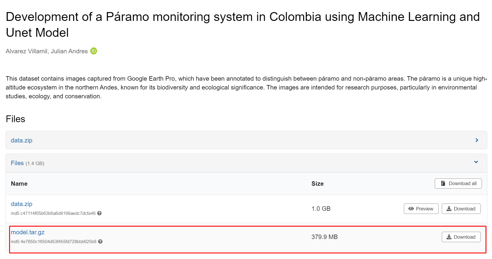

# UNET Image Segmentation

This repository contains Jupyter notebooks for training and evaluating a UNET model for image segmentation. The project is structured as follows:

## Description

The project is divided into three main notebooks:

1. **1.0-Data.ipynb**: This notebook handles data preprocessing, including splitting the dataset into training, validation, and evaluation sets, as well as performing data augmentation and normalization.
2. **2.0-UNET.ipynb**: This notebook is used to train the UNET model. It loads the preprocessed data, defines the model architecture, and trains the model.
3. **3.0-Inference.ipynb**: This notebook is used to perform inference using the trained UNET model. It evaluates the model on the validation set and deploy the model in AWS Sagemaker for real-time predictions.

## Data

The dataset used for training and evaluation is available on Zenodo. You can download it from the following link:

[Zenodo Data URL](https://zenodo.org/record/13124217)

## Model

The trained UNET model is also available on Zenodo. You can download it from the following link:

[Zenodo Model URL](https://zenodo.org/record/13124217)

## Usage

1. **Data Preprocessing**: Run the 1.0-Data.ipynb notebook to preprocess the data.
2. **Model Training**: Run the 2.0-UNET.ipynb notebook to train the UNET model.
3. **Inference**: Run the 3.0-Inference.ipynb notebook to evaluate the model and make predictions.

## Requirements

- Python 3.x
- Jupyter Notebook
- NumPy
- scikit-learn
- TensorFlow/Keras

Install the required packages using:

